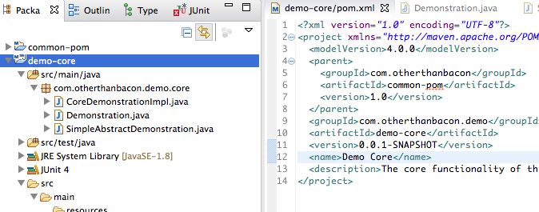
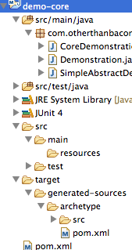
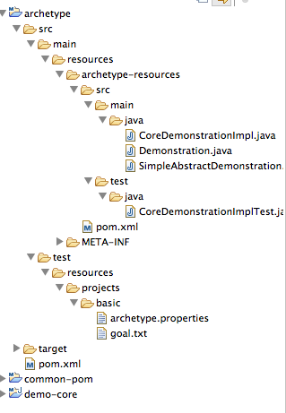
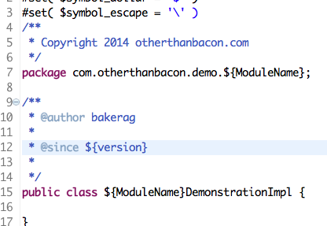
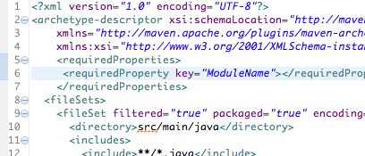
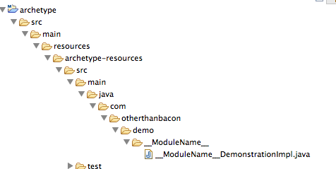

# theoria

**For standardizing across projects, guideline documents are great** but even better is when there are processes in place to get things started reliably in line with guidance. Eclipse has code templates and style settings that can make your code perfectly formatted, but it doesn't do much for project structure, naming and standard configuration. That's where maven archetypes come in. It is satisfying to automate processes that you know are only minor modifications on previous work, so when you find a project that you feel in your bones will be duplicated, **take it upon yourself to make it worth copying, and easy to copy**, create an archetype! When you are inevitably asked how to start on a project like the one they heard you worked on, you can tell them, "Run the archetype and you will have all the grunt work done, then you can do the programmer part." Then when they ask follow-up questions, you are already a little bit familiar with the project.

# praxis
For the unfamiliar, look at the [official introduction](http://maven.apache.org/guides/introduction/introduction-to-archetypes.html). It includes how to create a template from an existing project, which gets you off to a quick start, but be careful when you go through to get rid of all references specific to your project. **This exercise is also a good way to find opportunities to make shared libraries of code written for a single project.** The only thing better than automated code, is deleted code, so use this time to remove unnecessary code, since it will be propagated to any project that uses this template. There are several steps you will want to go through here, so when you are estimating this task, don't short change yourself. In the interest of keeping a nice little list, I will repeat  most of the list later, with more tips and pictures.

1. Find or make a project that is close to perfect
2. Run `archetype:create-from-project` against it
3. **move the new project out of the old**. Then you can import it as an _Existing Maven Project_
4. **replace common strings with template parameters**
    Java projects have a tendancy to have the same words over and over with pattern names dangling from the ends to distinguish classes. ThisThingDAO passes around ThisThing after being adapted by a ThisThingAdapter.
5. **think about package structure**, use parameters in there too.
6. **Make code that can work generically compilable**, this prevents users from having to spend time on things that could work out-of-the-box.
7. **Make code that cannot work fail compilation**, this prevents the template user from leaving it untouched. Assume instructions will be ignored.
8. **Write instructions anyway**, some people love instructions, and you will like having them when you have to show somebody what to do.

# e.g.
**For the more visual reader**, here are the steps again, with pictures:

1. Find or make a project that is close to perfect, this one looks good, it has a test class, an interface, abstract implementation, a concretion, a parent POM.

   

2. Run `archetype:create-from-project` against it
   you can do this from the command line, or in eclipse, run as -> maven build...
   **The console output** will tell you if you have anything set up wrong, check spelling first, it's the easiest to overlook.
   **Just refresh the project** and you should see it in the target folder

   

3. **move the archetype folder** out of target. Then you can import it as an _Existing Maven Project_

   

   notice The project is basically a copy of the original inside `src/main/resources/archetype-resources/` notice also the test package, it has some files to facilitate testing your archetype. More on that in a future post.
4. **replace common strings with template parameters**
    If this prototype is for more _demo_ projects, maybe you just need the second half of the project name as a parameter.

    

    The package and version parameters are built in, but `ModuleName` needs to be defined. This is done in the `src/main/resources/META-INF/maven/archetype-metadata.xml` folder
    
5. **think about package structure**, use parameters in there too.

   

  Notice, for files and folders, you use a double underscore, instead of dollar, brace ("${}").
  Also notice that I removed classes that really belong to the core library. It is also a good idea to go ahead and put that core library as a dependency in the POM.

6. **Make code that can work generically compilable**, this prevents users from having to spend time on things that could work out-of-the-box.

7. **Make code that cannot work fail compilation**, this prevents the template user from leaving it untouched. Assume instructions will be ignored.

8. **Write instructions anyway**, some people love instructions, and you will like having them when you have to show somebody what to do.
