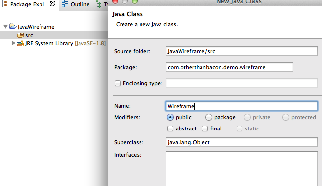
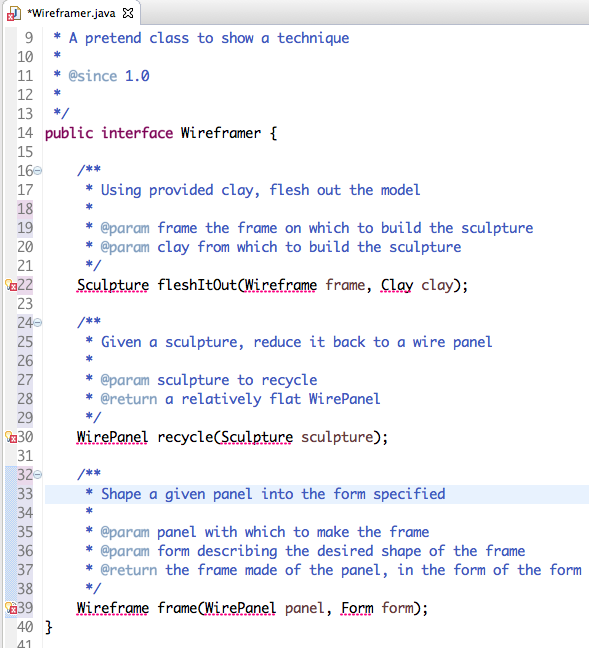
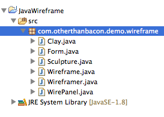
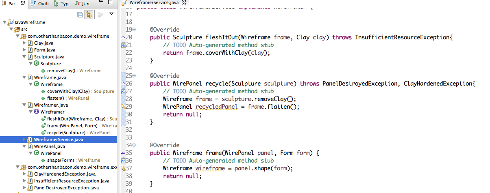

Auto-Complete as a Design Tool

**UML is a great tool** for sharing design concepts without a lot of baggage in the way. There are at least three problems with sharing an idea in UML:

1. The implementation may differ greatly from the design
   * The implementor might misread inheritance as composition, or interface realization as aggregation, or worse yet, the diagram can be forgotten.
2. The implementation isn't even begun until after the diagram is done.
  * This can be mitigated by code generation tools, but those tools tend to have their own set of problems.
3. Getting the lines and boxes in the right place is an arduous task.

**For a really high level description of a complicated system, this might be necessary**

But for something you would feel comfortable with having in a single artifact...

**There is another way**
If the end result is Java, why not start with Java, you are pretty good at it already and your IDE can make it go really quickly.

The **first** step is to get in your IDE with the understanding that you will not be creating *any* finished code. Think of this task as outlining, but instead of an ordered list, it is a java project.

**Next**, create a new Java, if you have an archetype that will do some work for you, use that, otherwise, just a plain Java project is fine.

**Then**, create the highest-level class you can think of, like this

**Now**, type out some methods, the full signature, including classes that are undefined. Add Javadoc if you think it will help the person picking up the work from you. I usually change my class to an interface at this point, and it's a good time to change the name too.

 

Now just hover on an squiggly red line, or click on an invalid object name and press ^1, or ⌘1 and you can create your class.

repeat as necessary

**For a deeper dive**, you can start coding, but just a little. Create an implementation class and start typing the methods it should probably call, try to ignore as many details as possible. If you think something needs a new name, this is the best time to refactor. Use quick-fix to create all your new methods and classes

**Then** take a minute to look over the structure you've made.

Go ahead and rearrange as needed, make sure you have allowed for growth. Look for more extension points and revisit the requirements, until you are comfortable that what you've started can get to the point where they are all satisfied.

**The trick is to start at the highest level** and act as if the rest is already done, then let the IDE create all the things you depend on. This leads to nice tight methods and classes, because you aren't doing any logic, you just have this object that must have this method to do this thing, then it should do this other thing. Next thing you know, you have a well layed out application ready to fill in the functionality.

**Approaching new work in this way** gets you used to what things should look like and will start to inform the way you work in old projects, refactoring them into a usable state. It can also be as clear as a diagram in some cases and saves a step. Java generated from a diagram rarely turns out the way you want, but generating a diagram from code can show you if you have done anything bad without messing up the actual working product.

**Bad code from a good diagram doesn't get you anywhere in building a project**. Bad diagrams from good code can probably be fixed.
